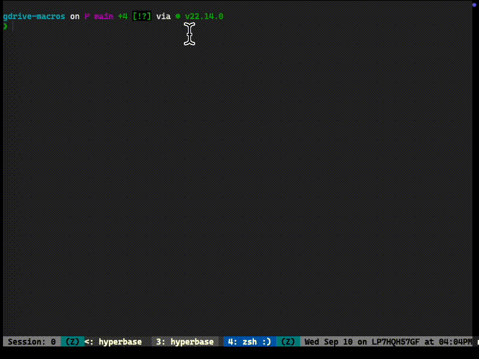

# Bookmarklet Compiler & RichLinker

A modular system for creating JavaScript bookmarklets with shared libraries. Includes RichLinker - a multi-platform rich link generator that works across Google Docs, Atlassian Confluence, and Airtable with smart duplicate detection.

## Quick Start

```bash
bin/js-to-bookmarklet src/bookmarklet/richlinker
```

## Project Structure

```
📁 src/                           # Source code directory
  ├── bookmarklet/                # Individual bookmarklet files
  │   ├── richlinker.js          # Multi-platform rich link generator
  │   └── ...                    # Additional bookmarklets
  └── js-lib/                    # Shared libraries (auto-included)
      ├── notifications.js       # Notification system with debug mode
      └── clipboard.js           # Modern clipboard utilities

📁 bin/                          # Executable scripts
  └── js-to-bookmarklet          # Bookmarklet compiler

🔧 .recent-bookmarklet           # Tracks most recently compiled file
```

1. Chrome opens with installation page
2. Drag the button to your bookmarks bar
3. Go to any supported site (Google Docs, Atlassian, Airtable) and click your bookmark
4. Paste anywhere and you get a rich formatted link!

## Features

### Smart Duplicate Detection
- **First Click**: Copies basic link (e.g., "My Document", "Task Title")
- **Second Click** (within 1 second): Includes context info (e.g., "My Document #Section Name", "Task Title #Table Name")
- Automatically detects current section/context from supported platforms

### Multi-Platform Support
- **Google Docs**: Document titles with section headers from navigation outline
- **Atlassian Confluence**: Clean page titles (removes space name and "Confluence" suffix)
- **Airtable**: Task titles from specific task detail pages
- **Rich Text**: HTML links that paste beautifully everywhere
- **Focus Issues**: Automatic workaround for browser clipboard permissions

### Professional UX
- Animated success/error notifications
- Size-optimized bookmarklet generation
- Clean installation process with drag-and-drop

## Customization

### Environment Variables
Customize the compiler behavior with these environment variables:

```bash
# Custom emoji for bookmarklet names
JS2BM_EMOJI="🔗" bin/js-to-bookmarklet src/bookmarklet/richlinker

# Custom source directories
JS2BM_JS_DIR="scripts" JS2BM_JS_LIB_DIR="shared" bin/js-to-bookmarklet my-tool

# Default usage (uses built-in defaults)
bin/js-to-bookmarklet src/bookmarklet/richlinker
```

### Edit the JavaScript
Modify files in `src/bookmarklet/` to change behavior, then regenerate with the command above.

You can create any bookmarklet with `bin/js-to-bookmarklet`

## Requirements

- Node.js and npm (required for minification with terser)

## Advanced Usage

### Duplicate Detection Behavior
The bookmarklet intelligently handles repeated clicks:

```
First click  → "Project Plan": https://docs.google.com/...
Second click → "Project Plan #Budget Analysis": https://docs.google.com/...
```

Works across all supported platforms (Google Docs, Atlassian, Airtable).

### Build Pipeline
The shell script provides a complete build and installation pipeline:
- **Minification**: Optimizes JavaScript for bookmarklet size limits
- **Cross-platform**: Works on macOS, Linux, and Windows
- **Browser Detection**: Auto-opens Chrome/Chromium for installation
- **Size Warnings**: Alerts if bookmarklet exceeds browser limits

## Troubleshooting

### Common Issues
- **"No handler found for this page"**: Make sure you're on a supported site (Google Docs, Atlassian Confluence, Airtable task pages)
- **"Copy failed"**: Try refreshing the page, check browser clipboard permissions
- **"Focus required"**: Click inside the document first, then try the bookmarklet

### Browser Compatibility
- **Chrome/Edge**: Full rich text support with HTML links
- **Safari**: Rich text support with occasional focus workarounds
- **Firefox**: May fall back to plain text formatting
- **All Browsers**: Plain text fallback ensures universal compatibility

### Technical Requirements
- **Node.js**: Required for `npm` and `npx` (JavaScript minification)
- **Modern Clipboard API**: For rich text support (graceful fallback provided)

## Demo


